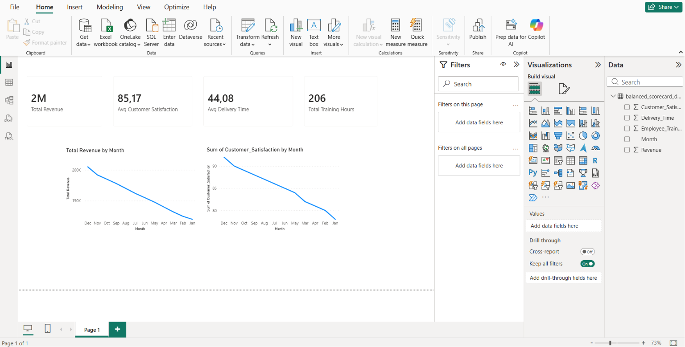

# Balanced Scorecard Dashboard

## Project Overview

This project presents a Balanced Scorecard Dashboard developed in Power BI.

The dashboard evaluates business performance from four perspectives:

* Financial
* Customer
* Internal Processes
* Learning & Growth

The goal is to visualize key business metrics and demonstrate how operational improvements can influence customer satisfaction and financial performance.

## Balanced Scorecard Perspectives

### Financial

* Total Revenue

### Customer

* Average Customer Satisfaction

### Internal Processes

* Average Delivery Time

### Learning & Growth

* Total Employee Training Hours

## Visualizations

* Revenue Trend by Month
* Customer Satisfaction Trend by Month
* KPI Cards for all four perspectives

## Key Insights

* Revenue increased throughout the year.
* Customer satisfaction improved over time.
* Delivery times decreased, indicating more efficient processes.
* Employee training hours increased during the year.
* Improvements in employee development and operational efficiency were associated with higher customer satisfaction and business performance.

## Tools Used

* Power BI Desktop
* CSV Dataset

## Dashboard Preview

